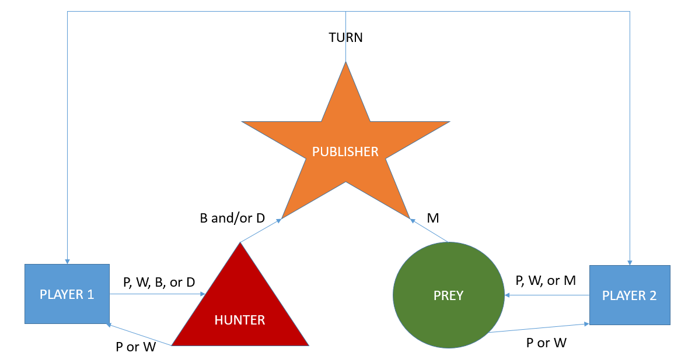

# Evasion

## Flow Diagram



The model used for the Architecture is the [pub-sub pattern](https://en.wikipedia.org/wiki/Publish%E2%80%93subscribe_pattern) for messaging. It may seem daunting at first, but it's surprisingly easy once you get the hang of it.

Above you can see the flow diagram. `Player 1` controls the hunter by sending `JSON` messages to it's designated websocket. It can queue up commands if it wishes (You may want to do nothing for long periods of time), and by asking it for current positions and list of walls. The Hunter socket will process the command and publish the results using the publisher socket, which will broadcast the new state to both the `Player 1` and `Player 2`. The same goes for `Player 2` and the prey.

Thus both `Player 1` and `Player 2` connect to two websockets each, the publisher and the respective player's websocket.

## High Level Architecture

* Port 1990 Web Socket: Both Prey and Hunter must connect to this port to received published gameplay
* Port 1991 Web Socket: Hunter's connection to Server
* Port 1992 Web Socket: Prey's connection to Server

Files:
  
  * server.js: node js file with all game logic
  * test.html : sample html5 + javascript websockets client

Folders:
  * evasion (dir) : eclipse maven project containing sample java websockets client
  * readme (dir) : documentation on bouncing rules, etc.

## Instructions:

```bash
npm install websocket
npm install express
```

```bash
nodejs server.js
```

or

```bash
node server.js
```

__NOTE:__ If you are running on energon2 you have latter command. Test locally or change ports if you are running on energon to avoid conflicts


