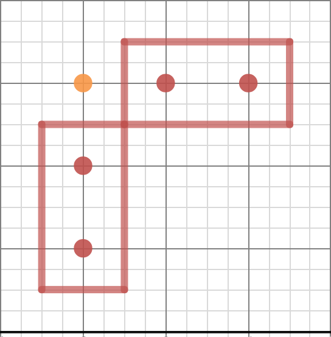
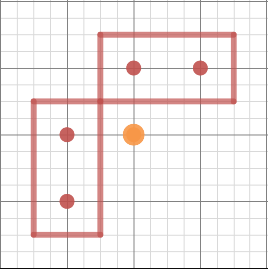
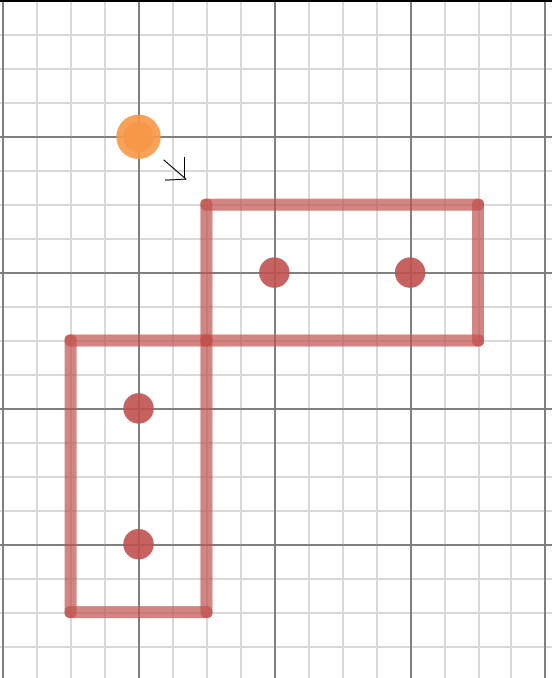
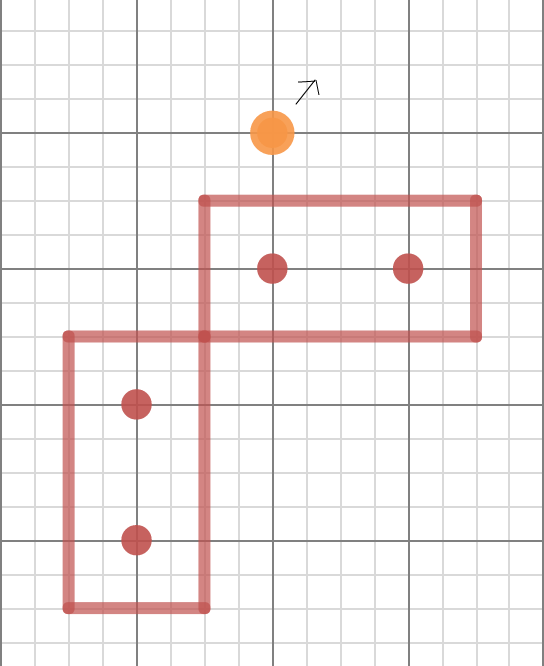
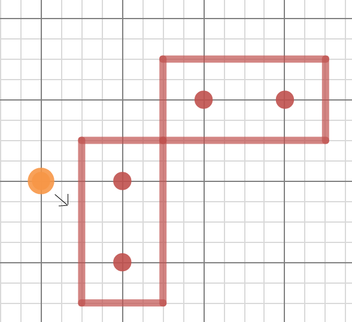
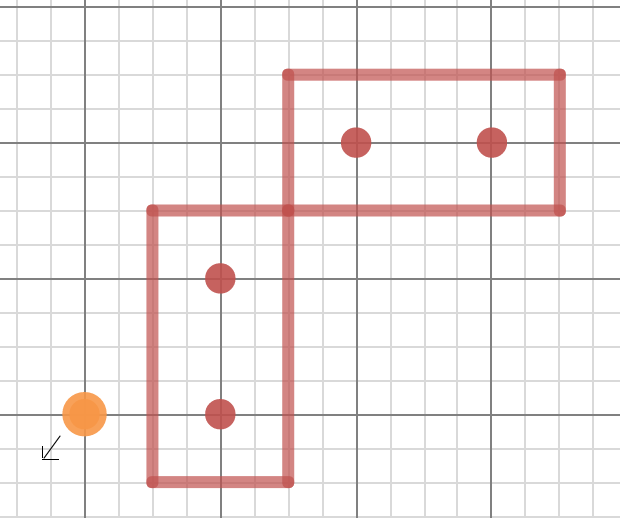
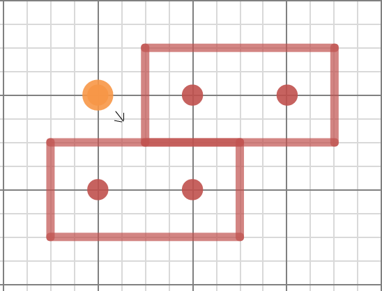
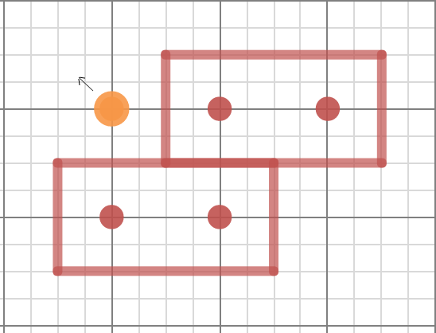

# Evasion game

Evasion is a game played on a `300 x 300` grid. The hunter starts at `(0,0)` and the prey starts at `(230,200)`. The goal is for the hunter to catch the prey while playing within the constraints below.

__Catching__ the prey means getting within a euclidean distance of 4 from it, and not having any walls inbetween the two.

## Movement

### Hunter

The hunter moves once per step, and it can only move diagonally. He starts off moving `SOUTHEAST`, only changing direction after _bouncing_. The hunter has the ability to create and delete these walls at will, except for the walls at the borders.

### Prey

The prey moves once every other turn, and can move in any given direction, but only one unit of movement. Thus, it can go from any one `(x,y)` to any adjacent `(x,y)` coordinate. It can not cross walls, and if it hits a wall, it simply stays in place without "bouncing".

## Building Walls

Walls are centered about points on an `(x,y)` coordinate plane. they have a thickness of .5 and are always of integer length.

A hunter can only build a wall every N step, and have a maximum of M walls at any given moment. The hunter can always delete a wall whenever it wants however.

When a hunter builds a wall, it builds the wall at a point that touches the hunter, but not at the hunter. For example, a hunter at point `(10,10)` builds a wall that goes `SOUTH` of him, the wall starts at point `(10,11)` and moves southward. The same works for `NORTH`, `EAST`, and `WEST`, each one moving over one unit in the given direction.

__Diagonal walls are not supported.__

An illustration:
A hunter builds an eastward and a southward wall, then moves southeast with no problem.

## Bouncing

When a hunter hits a wall, it bounces off and changes direction. The walls are centered around integer coordinates, so the hunter can never intersect with that wall (can't occupy the same coordinates)! Instead, it 'bounces' off by shifting along the wall and reversing its direction perpendicular to the collided wall.

Example of bouncing off horizontal wall.

Example of bouncing off vertical wall.

Example of a corner bounce

